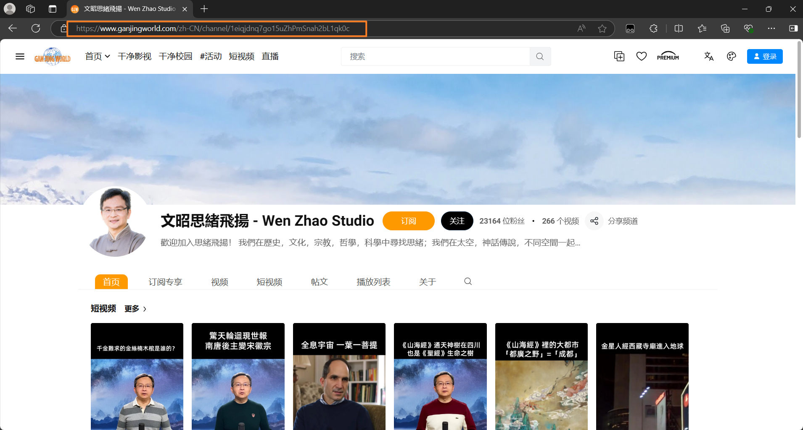

<div align=center></div>

<br>
<p align="center">


</p>
<h2 align=center><p>Podcast2</p></h2>
<hr>

## 项目说明
- 基于spring boot开发
- 将视频网站转换成播客订阅
## 详细请看[文档](https://yajuhua.github.io/)
## 快速开始

#### 使用Docker
1. 安装并启动Docker
```shell
curl -fsSL https://get.docker.com -o get-docker.sh && sh get-docker.sh && systemctl start docker
```
2. 创建并启动Docker
````shell
docker volume create podcast2
docker run -id --name=podcast2 \
-p 8088:8088 \
--restart=always \
--mount source=podcast2,destination=/data \
yajuhua/podcast2:latest
````
3. 防火墙放行端口
````shell
#以下是centos7，其他系统自行搜索。
firewall-cmd --add-port=8088/tcp --permanent
firewall-cmd --reload
````

#### 进入面板

> 默认访问地址 [http://你的IP地址:8088]()
>
> 默认用户名：admin <br>
> 默认密码：123456


#### 安装插件
> 项目默认是没有添加插件的，自行按需添加
#### 支持网站
| 网站                           | 状态                                                                                                                 |
|:---------------------------------------------|--------------------------------------------------------------------------------------------------------------------|
| [干净世界](https://ganjing.com/)                 |  |
| [ntdm](https://www.ntdm.tv)                  |            |
| [girigirilove](https://www.girigirilove.com) |    | 
| [youtube](https://www.youtube.com)           |       | 
| [bilibili](https://www.bilibili.com)         |       | 

1. 安装插件
   

2. 设置插件，如果有的话
   

#### 添加订阅
> 以干净世界为例
1. 复制主页链接
   

2. 粘贴并点击Add
   

3. 点击二维码
   

4. 扫描二维码添加到播客APP（如：AntennaPod）


#### 播客APP

<a href="https://www.apple.com/apple-podcasts/" target="_blank">
              
            </a><a href="https://podcastaddict.com/" target="_blank"></a>  <a href="https://antennapod.org/" target="_blank">
                        </a>

## Star History

## 使用到的项目
- [https://github.com/yt-dlp/yt-dlp](https://github.com/yt-dlp/yt-dlp)
- [https://github.com/nilaoda/N_m3u8DL-RE](https://github.com/nilaoda/N_m3u8DL-RE)
- [https://github.com/aria2/aria2](https://github.com/aria2/aria2)
- [https://github.com/SocialSisterYi/bilibili-API-collect](https://github.com/SocialSisterYi/bilibili-API-collect)

## 使用的加速站
- [https://github.moeyy.xyz](https://github.moeyy.xyz)
- [https://hub.gitmirror.com/](https://hub.gitmirror.com/)
- [https://ghproxy.com/](https://ghproxy.com/)
## 参考
- [https://github.com/mxpv/podsync](https://github.com/mxpv/podsync)
## 免责声明
**此项目仅供研究、学习和交流，请勿用于商业或非法用途， 开发者与协作者不对使用者负任何法律责任， 使用者自行承担因不当使用所产生的后果与责任。**

## 鸣谢
特别感谢 [JetBrains](https://www.jetbrains.com) 为开源项目提供免费的 [IntelliJ IDEA](https://www.jetbrains.com/idea)的授权  
[](https://www.jetbrains.com)


